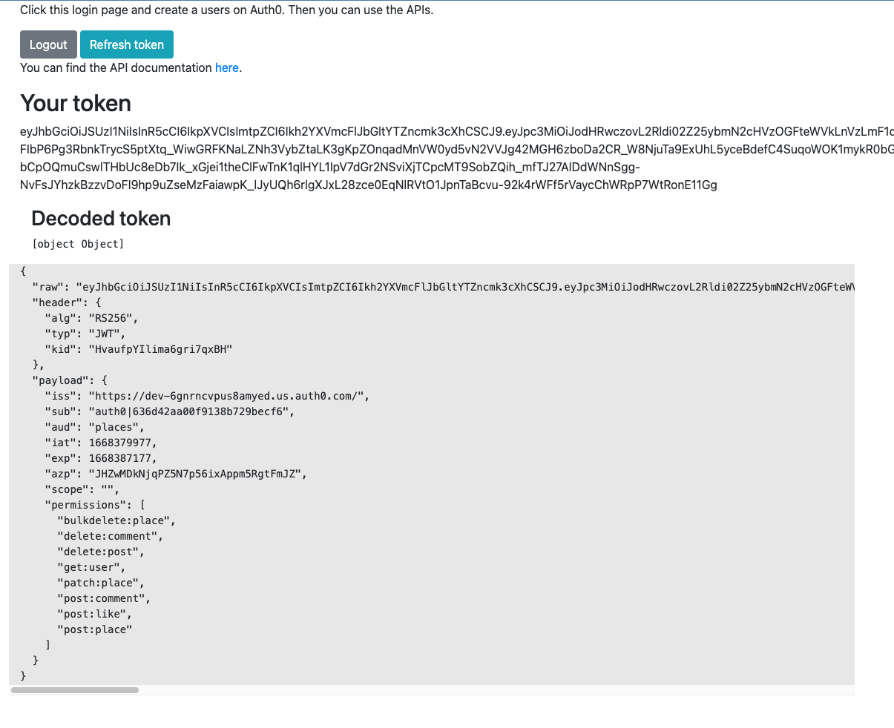

## How to run the frontend
The front end only includes the log in, log out and refresh token functionalities.
- Node.js needs to be installed in your system.

- Open terminal and run the command ``` 
npm install http-server -g```
- ``` cd frontend```
- Run ```http-server```

- Navigate to http://127.0.0.1:8080/login.html  and click on the login button.

The UI after log in should look like this:

